# Pipeline 1 — Da definição do tema à base pronta para análise

### Este documento registra o caminho percorrido até o ponto que antecede a análise exploratória: quais decisões foram tomadas, quais pontos geraram dúvida e por que cada caminho foi escolhido.

**Como ler o diagrama**

| Forma / cor | Significado |
|---|---|
| Losango amarelo | ponto de decisão, em que houve dúvida no grupo |
| Retângulo arredondado cinza | etapa executada, artefato gerado ou caminho escolhido |
| Retângulo arredondado com borda tracejada | alternativa descartada, com o motivo do descarte |

---

## Flowchart do projeto

```mermaid
flowchart TD

    %% ============ DEFINIÇÃO DO PROJETO ============
    A("Tema MADES - Market Analysis Driven by Event Studies<br/>Cruzar o comportamento do Bitcoin com<br/>macroeconomia, eventos e sentimento<br/>Reuniões de 06/08 e 13/08")

    D1{"Qual saída o<br/>modelo deve dar?"}
    D1S("ESCOLHIDO<br/>Classificador de compra e venda<br/>Motivo: saída acionável, que já<br/>embute o custo de operar")

    D2{"Escopo geográfico:<br/>global ou local?"}
    D2S("ESCOLHIDO<br/>Global, com possibilidade de filtrar por bloco<br/>Motivo: sugestão do professor de clusterizar<br/>e fazer análise intra-cluster")

    D3{"Uma fonte só ou<br/>fontes heterogêneas?"}
    D3S("ESCOLHIDO<br/>Duas trilhas, desenvolvidas em paralelo<br/>Motivo: lidar com fontes heterogêneas<br/>é o desafio central da disciplina")

    A --> D1 --> D1S --> D2 --> D2S --> D3 --> D3S

    D3S --> E0
    D3S --> N0

    %% ============ TRILHA ESTRUTURADA ============
    E0("TRILHA ESTRUTURADA - macro e mercado<br/>Leonardo Demore e Victor Botelho<br/>20/08 a 03/09")

    E1{"Quais países<br/>incluir?"}
    E1S("ESCOLHIDO<br/>G8 mais BRICS: EUA, Alemanha, França, Itália,<br/>Reino Unido, Canadá, Japão,<br/>China, Índia, Brasil e África do Sul")
    E1X("DESCARTADO: Rússia<br/>Motivo: após as sanções de 2022, a cobertura<br/>do FRED e do Yahoo Finance ficou<br/>incompleta ou descontinuada")

    E2{"Qual granularidade<br/>temporal?"}
    E2S("ESCOLHIDO<br/>Escala diária<br/>Motivo: é a menor granularidade comum<br/>a todas as fontes; o macro é mensal")
    E2X("DESCARTADO: intradiário, por hora ou minuto<br/>Motivo: existe para cripto, mas não para<br/>juros e inflação; geraria repetição<br/>de valores sem informação nova")
    E2X2("DESCARTADO: semanal ou mensal<br/>Motivo: a maioria das séries já é diária;<br/>agregar para cima jogaria fora observações<br/>e reduziria demais o número de linhas")

    E3{"Qual janela<br/>temporal?"}
    E3S("ESCOLHIDO<br/>01/01/2016 a 01/01/2026<br/>Motivo: 10 anos cobrem juro zero,<br/>pandemia, aperto monetário e ETFs")

    E4{"De onde tirar<br/>juros e inflação?"}
    E4S("ESCOLHIDO<br/>FRED como fonte padrão<br/>Motivo: séries já harmonizadas pela OCDE,<br/>o que torna os países comparáveis")
    E4C("COMPLEMENTO<br/>Onde o FRED não cobre bem, usar a fonte oficial:<br/>Bank of England, Bank of Canada,<br/>Banco Central do Brasil e Statistics Canada")

    E5{"Quais variáveis de<br/>mercado por país?"}
    E5S("ESCOLHIDO, por país:<br/>1 índice de ações, 1 taxa de juros,<br/>1 CPI e 1 par de câmbio contra o dólar<br/>Motivo: estrutura simétrica,<br/>que permite comparar blocos")
    E5X("DESCARTADO: VIX, dados on-chain e APY<br/>Motivo: citados na proposta inicial, mas<br/>ficaram fora desta etapa para manter<br/>a simetria entre os países")

    E6("Definir os tickers de cada série em config.py<br/>FRED, yfinance e séries oficiais")
    E7("Coletar via APIs com data_collector.py<br/>Um CSV por fonte")
    E7A("ARTEFATO<br/>btc_data.csv, fred_data.csv, yfinance_data.csv,<br/>uk_rate_data.csv, canada_rate.csv,<br/>canada_cpi.csv e selic_data.csv")

    E0 --> E1
    E1 --> E1S
    E1 -.-> E1X
    E1S --> E2
    E2 --> E2S
    E2 -.-> E2X
    E2 -.-> E2X2
    E2S --> E3 --> E3S --> E4
    E4 --> E4S --> E4C --> E5
    E5 --> E5S
    E5 -.-> E5X
    E5S --> E6 --> E7 --> E7A

    %% ============ TRILHA NÃO ESTRUTURADA ============
    N0("TRILHA NÃO ESTRUTURADA - notícias e eventos<br/>Julio Cesar Fuganti<br/>20/08 a 03/09")

    N1{"Qual base de<br/>notícias usar?"}
    N1S("ESCOLHIDO<br/>GDELT GKG, via BigQuery<br/>Motivo: já traz sentimento, temas e<br/>organizações extraídos, com cobertura global")

    N2{"Coletar toda a web<br/>ou filtrar fontes?"}
    N2S("ESCOLHIDO<br/>Cinco fontes: Bloomberg, Reuters, CoinDesk,<br/>Cointelegraph e The Block<br/>Motivo: controlar a qualidade e o custo<br/>da query; GDELT indexa muito ruído")

    N3("Coletar com dry run antes de executar<br/>para estimar o custo em GB<br/>e remover duplicatas por URL")
    N3A("ARTEFATO<br/>79.186 notícias únicas com<br/>sentimento, temas e organizações")

    N4{"Como usar temas e organizações?<br/>4.844 tags e 25.004 orgs"}
    N4X("PROBLEMA IDENTIFICADO<br/>Usar tudo geraria mais de 80 variáveis<br/>com esparsidade altíssima")
    N4S("ESCOLHIDO<br/>Agrupar em macro categorias<br/>por clusterização semântica")

    N5("Remover a stop-word de domínio ECON_BITCOIN<br/>Motivo: aparece em 99,64% das notícias,<br/>porque a busca foi feita por bitcoin;<br/>não separa nada")
    N6("Selecionar as 80 tags e as 50 organizações<br/>mais frequentes, por Pareto e Zipf<br/>Resultado: 130 conceitos que cobrem<br/>98,58% das notícias")
    N7("Montar a matriz binária notícia x conceito,<br/>transpor e normalizar em L2<br/>Motivo: agrupar as variáveis entre si,<br/>e não as notícias, por coocorrência angular")

    N8{"Qual algoritmo de<br/>clusterização?"}
    N8S("ESCOLHIDO<br/>Aglomerativo hierárquico com ligação de Ward<br/>Motivo: gera dendrograma, que torna o<br/>agrupamento auditável; não exige k fixo de início<br/>e lida bem com grupos de tamanhos diferentes")
    N8X("DESCARTADOS<br/>K-Means: assume grupos esféricos e de<br/>tamanho parecido, o que não vale para tags<br/>DBSCAN: em dados binários esparsos, a densidade<br/>é quase uniforme e quase tudo vira ruído")

    N9{"Quantos clusters?"}
    N9S("ESCOLHIDO<br/>k = 10, testando k de 2 a 10 pelo<br/>Silhouette Score, sem escolha arbitrária<br/>Ressalva: o score de 0,068 é baixo,<br/>então as fronteiras são fracas")

    N10("Gerar 3 features por cluster:<br/>contagem, flag e sentimento médio")
    N11("Agregar por dia:<br/>volume de notícias e sentimento médio")
    N11A("ARTEFATO<br/>Base diária de eventos,<br/>com 10 clusters temáticos")

    N0 --> N1 --> N1S --> N2 --> N2S --> N3 --> N3A --> N4
    N4 --> N4X --> N4S --> N5 --> N6 --> N7 --> N8
    N8 --> N8S
    N8 -.-> N8X
    N8S --> N9 --> N9S --> N10 --> N11 --> N11A

    %% ============ JUNÇÃO E PUBLICAÇÃO ============
    U1{"Qual calendário<br/>usar como base?"}
    U1S("ESCOLHIDO<br/>O calendário do Bitcoin<br/>Motivo: o BTC negocia 7 dias por semana,<br/>então é a série mais completa e é o alvo")
    U1X("DESCARTADO: calendário das bolsas<br/>Motivo: descartaria fins de semana e feriados,<br/>justamente quando o BTC costuma<br/>se mover sem os mercados abertos")

    U2("Left join de todos os CSVs<br/>sobre as datas do BTC")

    U3{"Como tratar os buracos<br/>de mercados fechados e<br/>de séries mensais?"}
    U3S("ESCOLHIDO<br/>Forward fill: repetir o último valor conhecido<br/>Motivo: é a informação disponível ao investidor<br/>naquele dia; não inventa dado nem olha o futuro")
    U3X("DESCARTADO: interpolação<br/>Motivo: criaria valores que nunca existiram e<br/>usaria informação futura, o que é vazamento")

    U4("Remover as 3 primeiras linhas,<br/>que ficaram nulas por serem feriado<br/>de virada de ano em 2016")
    U4A("ARTEFATO<br/>final_dataframe.csv<br/>3.650 dias x 43 variáveis,<br/>sem nulos e sem duplicatas")

    U5{"Como compartilhar<br/>a base com o grupo?"}
    U5S("ESCOLHIDO<br/>Publicar no HuggingFace<br/>Motivo: todos baixam a mesma versão sem<br/>precisar de API keys nem refazer a coleta")
    U5X("DESCARTADO: versionar os CSVs no Git<br/>Motivo: arquivos grandes e binários<br/>poluem o histórico do repositório")

    E7A --> U1
    U1 --> U1S
    U1 -.-> U1X
    U1S --> U2 --> U3
    U3 --> U3S
    U3 -.-> U3X
    U3S --> U4 --> U4A --> U5
    U5 --> U5S
    U5 -.-> U5X

    FIM("Bases prontas para a análise exploratória")

    U5S --> FIM
    N11A --> FIM

    %% ============ ESTILOS ============
    classDef decisao fill:#f8e3a6,stroke:#d99400,stroke-width:2px,color:#0b0b0b
    classDef padrao fill:#dbd7cd,stroke:#7c7a74,stroke-width:1.5px,color:#0b0b0b
    classDef descarte fill:#eceae3,stroke:#7c7a74,stroke-width:1.5px,stroke-dasharray:5 4,color:#0b0b0b

    class D1,D2,D3,E1,E2,E3,E4,E5,N1,N2,N4,N8,N9,U1,U3,U5 decisao
    class A,D1S,D2S,D3S,E0,E1S,E2S,E3S,E4S,E4C,E5S,E6,E7,E7A,N0,N1S,N2S,N3,N3A,N4S,N5,N6,N7,N8S,N9S,N10,N11,N11A,U1S,U2,U3S,U4,U4A,U5S,FIM padrao
    class E1X,E2X,E2X2,E5X,N4X,N8X,U1X,U3X,U5X descarte
```

